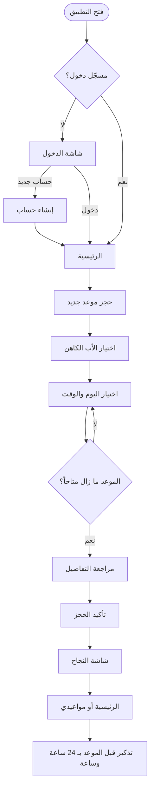
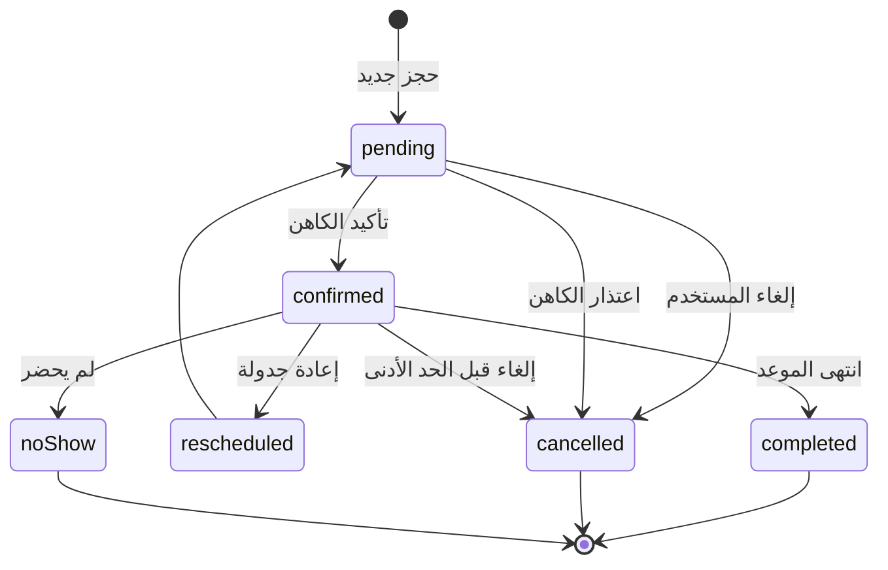

# 🕊️ دليل تصميم الواجهة وتجربة المستخدم (UI/UX)

## تطبيق «اعتراف» — حجز مواعيد الاعتراف الكنسي

**كنيسة الشهيد العظيم مارمينا والقديس البابا كيرلس السادس — السويس**

| | |
|---|---|
| **الإصدار** | 1.0 |
| **المنصة** | Flutter (Android + iOS) |
| **اللغة والاتجاه** | العربية · RTL أولاً |
| **مقاس التصميم الأساسي** | 390 × 844 pt (iPhone 14) مع دعم 360 × 640 كحد أدنى |
| **الاستخدام** | مرجع للمصمم والمطوّر و Cursor — كل قيمة هنا قابلة للنسخ إلى الكود |

> **كيف تستخدم هذا الملف مع Cursor؟** ضعه في `docs/UI_UX_DESIGN.md` ثم اكتب في أي برومبت: `@docs/UI_UX_DESIGN.md implement screen 3 (Home) following section 7.3 and the motion spec in section 8`. الأقسام مرقّمة عمداً ليسهل الإشارة إليها.

---

## 📑 الفهرس

1. [الرؤية ومبادئ التصميم](#1-الرؤية-ومبادئ-التصميم)
2. [الهوية البصرية](#2-الهوية-البصرية)
3. [Design Tokens](#3-design-tokens)
4. [التخطيط و RTL والاستجابة](#4-التخطيط-و-rtl-والاستجابة)
5. [مكتبة المكونات](#5-مكتبة-المكونات)
6. [رحلة المستخدم وحالات الموعد](#6-رحلة-المستخدم-وحالات-الموعد)
7. [مواصفات الشاشات](#7-مواصفات-الشاشات)
8. [نظام الحركة والأنيميشن](#8-نظام-الحركة-والأنيميشن)
9. [حالات الفراغ والتحميل والخطأ](#9-حالات-الفراغ-والتحميل-والخطأ)
10. [النصوص (Microcopy)](#10-النصوص-microcopy)
11. [إمكانية الوصول](#11-إمكانية-الوصول-accessibility)
12. [الأداء وميزانية الحركة](#12-الأداء-وميزانية-الحركة)
13. [ملاحظات على التصميم الحالي](#13-ملاحظات-على-التصميم-الحالي)
14. [شاشات مقترحة إضافية](#14-شاشات-مقترحة-إضافية)
15. [الأصول والحزم وهيكل الملفات](#15-الأصول-والحزم-وهيكل-الملفات)
16. [قائمة فحص الجودة (Definition of Done)](#16-قائمة-فحص-الجودة-definition-of-done)
17. [برومبتات Cursor الجاهزة](#17-برومبتات-cursor-الجاهزة)

---

## 1) الرؤية ومبادئ التصميم

### 1.1 الرؤية
تطبيق يجعل الوصول إلى سر الاعتراف **سهلاً وهادئاً وخاصاً**. المستخدم يفتح التطبيق وهو في حالة تأمل أو استعداد روحي، فالواجهة يجب أن تكون **ساكنة وواضحة** لا صاخبة ولا مزدحمة.

### 1.2 المبادئ الستة

| # | المبدأ | ماذا يعني عملياً |
|---|---|---|
| 1 | **الهدوء أولاً** | مساحات بيضاء واسعة، ألوان باردة، حركة ناعمة بلا ارتداد مبالَغ فيه. |
| 2 | **وقار وبساطة** | لا رسوم كرتونية ولا Emoji في الشاشات الرسمية (الاستثناء: 👋 في تحية الرئيسية كما في التصميم). |
| 3 | **الخصوصية مرئية** | يشعر المستخدم أن بياناته محمية: لا أسماء الآخرين، لا محتوى اعتراف، رسائل تطمين. |
| 4 | **أقل عدد نقرات** | الحجز في 4 خطوات فقط: كاهن ← موعد ← مراجعة ← تأكيد. |
| 5 | **لا مفاجآت** | كل إجراء هدّام (إلغاء) يطلب تأكيداً، وكل نجاح يُحتفى به بلطف. |
| 6 | **شمولية** | يستخدمه الشاب وكبير السن: خطوط كبيرة، أهداف لمس ≥ 48dp، تباين عالٍ. |

### 1.3 الشخصية والنبرة

- **الصوت:** دافئ، محترم، أبوي بلا تعالٍ. مثال: «سلام الرب معك دائماً».
- **تجنّب:** لغة الضغط أو الذنب («فاتك موعدك!»). استخدم بدلها «يمكنك حجز موعد جديد متى شئت».
- **المخاطبة:** بصيغة المخاطب المفرد بالعامية المهذبة الفصيحة (فصحى مبسطة)، لا عامية شارع.

---

## 2) الهوية البصرية

### 2.1 الشعار
- **الرمز:** صليب ذهبي تحيط به أشعة (مستخدم في شاشة الدخول) + رمز الكنيسة بالقبة (القائمة الجانبية).
- **مساحة الأمان:** ½ ارتفاع الصليب من كل جانب.
- **الحد الأدنى للحجم:** 24 dp للأيقونة، 96 dp للشعار الكامل مع الاسم.
- **لا تفعل:** تدوير الصليب، تلوينه بغير الذهبي/الأبيض، وضعه فوق صور مزدحمة دون طبقة تعتيم.

### 2.2 الصور
- **صور الآباء الكهنة:** دائرية 1:1، تُقص مركزياً على الوجه، خلفية محايدة. **بإذن كتابي من كل أب.** لا صور بديلة مولّدة في النسخة النهائية (الموجودة في التصميم الحالي تصلح كـ placeholder فقط).
- **صور الكنيسة والبانر:** تُضاف طبقة تدرّج داكن `#0A2540 @ 55%` من الأسفل ليقرأ النص الأبيض بوضوح.
- **الأيقونات:** حزمة واحدة فقط بنمط **Outline بسمك 1.75px** (مثل Lucide أو Phosphor Regular). لا خلط أنماط.

### 2.3 الأسلوب البصري

| العنصر | القيمة |
|---|---|
| الزوايا | مستديرة معتدلة (12–20 dp) — لا حادة ولا كبسولة كاملة إلا للأزرار والشارات |
| الظلال | خفيفة جداً بلون أزرق-رمادي، أو حد رفيع 1px بدل الظل |
| الخلفيات | أبيض / أزرق ثلجي، تُستخدم البلاطات الملوّنة الفاتحة للتصنيف فقط |
| التدرجات | فقط في الأشعة الذهبية وبانر الآية، لا على الأزرار |

---

## 3) Design Tokens

### 3.1 الألوان — الوضع الفاتح

> نِسب التباين محسوبة فعلياً بمعيار WCAG 2.1 وليست تقديرية.

**الأساسية (Brand)**

| Token | القيمة | الاستخدام |
|---|---|---|
| `primary900` | `#0A2540` | القائمة الجانبية، عناوين قوية |
| `primary700` | `#0F3D63` | الأزرار الأساسية، AppBar النشط |
| `primary600` | `#1F62A8` | الروابط («إنشاء حساب») — 6.23:1 على الأبيض |
| `primary100` | `#E6F0FA` | خلفية الأيقونات، أزرار ثانوية، Chip |
| `primary50` | `#F3F8FD` | خلفية العناصر المحددة بلطف |
| `gold500` | `#C9A24B` | **زخرفي فقط** (الصليب، الأشعة، حد ذهبي) — لا يُستخدم نصاً على الأبيض (2.4:1) |
| `gold700` | `#7A5C14` | نص ذهبي على `gold100` — 5.64:1 |
| `gold100` | `#FBF3E0` | خلفيات دافئة، بلاطة «مواعيدي» |

**المحايدة (Neutral)**

| Token | القيمة | الاستخدام | التباين |
|---|---|---|---|
| `bg` | `#F6F8FB` | خلفية الشاشات | — |
| `surface` | `#FFFFFF` | البطاقات، الحقول | — |
| `border` | `#E3E9F0` | الحدود والفواصل | — |
| `text900` | `#0F2238` | العناوين والنص الأساسي | 16.08:1 |
| `text600` | `#5B6B7D` | النص الثانوي | 5.46:1 |
| `text500` | `#64748B` | Placeholder، أيقونات خافتة | 4.76:1 |
| `disabled` | `#B8C2CE` | عناصر معطّلة (غير مطلوب تباين) | — |

**الدلالية (Semantic)**

| Token | القيمة | نص عليه | التباين |
|---|---|---|---|
| `success500` | `#1E9E5A` | أيقونة نجاح (رسم كبير فقط) | 3.45:1 مع أبيض |
| `success700` | `#146C3E` | نص «مؤكد» | 5.71:1 على `success100` |
| `success100` | `#E3F5EA` | خلفية شارة النجاح | — |
| `danger500` | `#D94040` | أيقونة الخطأ | — |
| `danger700` | `#B42B2B` | نص «إلغاء» | 5.54:1 على `danger100` |
| `danger100` | `#FDECEC` | خلفية زر/شارة الخطر | — |
| `warning700` | `#8A5A00` | نص «قيد الانتظار» | 5.37:1 على `warning100` |
| `warning100` | `#FFF3D6` | خلفية شارة الانتظار | — |

**بلاطات الرئيسية (Tiles)**

| البلاطة | الخلفية | الأيقونة/النص |
|---|---|---|
| حجز موعد جديد | `#E8F1FB` | `primary700` (9.85:1) |
| مواعيدي | `#FDF3E3` | `text900` |
| كهنة الكنيسة | `#EEF0FB` | `primary700` |
| معلومات وإرشادات | `#E6F5EA` | `success700` |

### 3.2 الألوان — الوضع الداكن

| Token | القيمة | ملاحظة |
|---|---|---|
| `bg` | `#0B1622` | |
| `surface` | `#12202F` | |
| `surfaceHigh` | `#182A3D` | بطاقات مرتفعة |
| `border` | `#24384D` | |
| `text` | `#EAF1F8` | 16.0:1 على bg |
| `text2` | `#9DB0C3` | 7.41:1 على surface |
| `accent` | `#7DB8EE` | بديل `primary` — 7.82:1؛ النص عليه `#0A2540` بتباين 7.37:1 |
| `gold` | `#E3C171` | 9.53:1 |
| `success` | `#5FD08F` | 8.56:1 |
| `danger` | `#FF8A8A` | 7.27:1 |

> في الداكن: **لا ظلال**؛ استخدم اختلاف درجة `surface` لإظهار الارتفاع.

### 3.3 الخطوط (Typography)

**العائلة:** `Cairo` (عناوين + نص) عبر `google_fonts`. البديل: `Tajawal`. الأرقام: لاتينية افتراضياً مع خيار تبديل للأرقام العربية-الهندية في الإعدادات.

| النمط | الحجم | الوزن | ارتفاع السطر | الاستخدام |
|---|---|---|---|---|
| `display` | 28 | 800 | 1.25 | اسم الكنيسة في الشاشة الأولى |
| `h1` | 22 | 700 | 1.3 | عنوان الشاشة |
| `h2` | 18 | 700 | 1.35 | عنوان قسم / بطاقة |
| `title` | 16 | 700 | 1.4 | اسم الأب، عنوان عنصر |
| `body` | 15 | 500 | 1.6 | النص العام |
| `bodySmall` | 13 | 500 | 1.55 | معلومات ثانوية |
| `label` | 14 | 700 | 1.2 | نص الأزرار |
| `caption` | 12 | 500 | 1.4 | تسميات صغيرة، أيام التقويم |

**قواعد:** لا تنزل عن 12 sp. يجب أن يتحمل كل نص تكبير النظام حتى **200%** دون قص (استخدم `Flexible` و `maxLines` مع `overflow`). النص العربي لا يُميّل (no italic).

### 3.4 المسافات (Spacing) — شبكة 4pt

| Token | القيمة |
|---|---|
| `xxs` | 4 |
| `xs` | 8 |
| `sm` | 12 |
| `md` | 16 |
| `lg` | 20 |
| `xl` | 24 |
| `xxl` | 32 |
| `xxxl` | 48 |

هوامش الشاشة الجانبية: **20**. المسافة بين البطاقات: **12**. داخل البطاقة: **16**.

### 3.5 الزوايا والارتفاع

| Token | القيمة | الاستخدام |
|---|---|---|
| `radiusSm` | 8 | Chip صغير |
| `radiusMd` | 12 | حقول الإدخال، أزرار |
| `radiusLg` | 16 | البطاقات |
| `radiusXl` | 24 | Bottom Sheet (الحواف العلوية) |
| `radiusFull` | 999 | الشارات، الصور الدائرية |

| مستوى الارتفاع | الظل (فاتح) |
|---|---|
| `elev0` | بلا ظل + حد `border` |
| `elev1` | `0 1px 2px rgba(15,34,56,.06), 0 2px 8px rgba(15,34,56,.05)` |
| `elev2` | `0 4px 16px rgba(15,34,56,.10)` (Bottom Sheet، Dialog) |

### 3.6 كود Flutter للـ Tokens

```dart
// lib/core/theme/app_colors.dart
import 'package:flutter/material.dart';

abstract class AppColors {
  // Brand
  static const primary900 = Color(0xFF0A2540);
  static const primary700 = Color(0xFF0F3D63);
  static const primary600 = Color(0xFF1F62A8);
  static const primary100 = Color(0xFFE6F0FA);
  static const primary50  = Color(0xFFF3F8FD);
  static const gold500    = Color(0xFFC9A24B);
  static const gold700    = Color(0xFF7A5C14);
  static const gold100    = Color(0xFFFBF3E0);

  // Neutral
  static const bg       = Color(0xFFF6F8FB);
  static const surface  = Color(0xFFFFFFFF);
  static const border   = Color(0xFFE3E9F0);
  static const text900  = Color(0xFF0F2238);
  static const text600  = Color(0xFF5B6B7D);
  static const text500  = Color(0xFF64748B);
  static const disabled = Color(0xFFB8C2CE);

  // Semantic
  static const success500 = Color(0xFF1E9E5A);
  static const success700 = Color(0xFF146C3E);
  static const success100 = Color(0xFFE3F5EA);
  static const danger500  = Color(0xFFD94040);
  static const danger700  = Color(0xFFB42B2B);
  static const danger100  = Color(0xFFFDECEC);
  static const warning700 = Color(0xFF8A5A00);
  static const warning100 = Color(0xFFFFF3D6);

  // Tiles
  static const tileBlue     = Color(0xFFE8F1FB);
  static const tileCream    = Color(0xFFFDF3E3);
  static const tileLavender = Color(0xFFEEF0FB);
  static const tileGreen    = Color(0xFFE6F5EA);
}

abstract class AppSpacing {
  static const xxs = 4.0, xs = 8.0, sm = 12.0, md = 16.0;
  static const lg = 20.0, xl = 24.0, xxl = 32.0, xxxl = 48.0;
}

abstract class AppRadius {
  static const sm = 8.0, md = 12.0, lg = 16.0, xl = 24.0, full = 999.0;
}
```

```dart
// lib/core/theme/app_theme.dart
import 'package:flutter/material.dart';
import 'package:google_fonts/google_fonts.dart';
import 'app_colors.dart';

ThemeData buildLightTheme() {
  final base = ThemeData(
    useMaterial3: true,
    colorScheme: ColorScheme.fromSeed(
      seedColor: AppColors.primary700,
      primary: AppColors.primary700,
      onPrimary: Colors.white,
      surface: AppColors.surface,
      error: AppColors.danger700,
      brightness: Brightness.light,
    ),
    scaffoldBackgroundColor: AppColors.bg,
  );

  final text = GoogleFonts.cairoTextTheme(base.textTheme).apply(
    bodyColor: AppColors.text900,
    displayColor: AppColors.text900,
  );

  return base.copyWith(
    textTheme: text,
    appBarTheme: AppBarTheme(
      backgroundColor: AppColors.bg,
      elevation: 0,
      scrolledUnderElevation: 0,
      centerTitle: true,
      foregroundColor: AppColors.text900,
      titleTextStyle: GoogleFonts.cairo(
        fontSize: 18, fontWeight: FontWeight.w700, color: AppColors.text900),
    ),
    inputDecorationTheme: InputDecorationTheme(
      filled: true,
      fillColor: AppColors.surface,
      contentPadding:
          const EdgeInsets.symmetric(horizontal: 16, vertical: 16),
      hintStyle: const TextStyle(color: AppColors.text500),
      border: OutlineInputBorder(
        borderRadius: BorderRadius.circular(AppRadius.md),
        borderSide: const BorderSide(color: AppColors.border),
      ),
      enabledBorder: OutlineInputBorder(
        borderRadius: BorderRadius.circular(AppRadius.md),
        borderSide: const BorderSide(color: AppColors.border),
      ),
      focusedBorder: OutlineInputBorder(
        borderRadius: BorderRadius.circular(AppRadius.md),
        borderSide: const BorderSide(color: AppColors.primary700, width: 1.6),
      ),
      errorBorder: OutlineInputBorder(
        borderRadius: BorderRadius.circular(AppRadius.md),
        borderSide: const BorderSide(color: AppColors.danger500),
      ),
    ),
    elevatedButtonTheme: ElevatedButtonThemeData(
      style: ElevatedButton.styleFrom(
        backgroundColor: AppColors.primary700,
        foregroundColor: Colors.white,
        minimumSize: const Size.fromHeight(52),
        shape: RoundedRectangleBorder(
          borderRadius: BorderRadius.circular(AppRadius.md)),
        textStyle: GoogleFonts.cairo(
          fontSize: 16, fontWeight: FontWeight.w700),
        elevation: 0,
      ),
    ),
    cardTheme: CardThemeData(
      color: AppColors.surface,
      elevation: 0,
      shape: RoundedRectangleBorder(
        borderRadius: BorderRadius.circular(AppRadius.lg),
        side: const BorderSide(color: AppColors.border),
      ),
    ),
  );
}
```

> ملاحظة: يفرض اتجاه RTL من `MaterialApp(locale: Locale('ar'), supportedLocales: [Locale('ar')], localizationsDelegates: GlobalMaterialLocalizations.delegates)`. لا تكتب `Directionality` يدوياً.

---

## 4) التخطيط و RTL والاستجابة

### 4.1 قواعد RTL الإلزامية

- استخدم `EdgeInsetsDirectional`، `AlignmentDirectional`، `start/end` — **ممنوع** `left/right` في أي مكان.
- **الأيقونات الاتجاهية** (سهم رجوع، سهم تالي `›`) تنعكس تلقائياً؛ أيقونات غير اتجاهية (ساعة، تقويم، إشعار) لا تنعكس.
- **الأرقام والأوقات** تبقى اتجاهها LTR داخل النص: `5:00 م`، `2025`. استخدم `intl` مع `DateFormat('EEEE d MMMM y', 'ar')`.
- **شريط التقويم:** يبدأ من **السبت** (أسبوع كنسي/مصري) ويقرأ من اليمين لليسار.
- **التقدم/الشرائح:** تتقدم من اليمين لليسار.

### 4.2 الشبكة والهوامش

- عمود واحد على الهاتف، هامش جانبي 20، بلاطات الرئيسية شبكة **2 × 2** بمسافة 12.
- **مناطق آمنة:** استخدم `SafeArea`؛ زر الإجراء الأساسي ثابت أسفل الشاشة بهامش 16 فوق الـ Home Indicator.
- أقصى عرض للمحتوى على الأجهزة الكبيرة/الويب: **560 dp** متمركزاً.

### 4.3 نقاط الاستجابة

| الفئة | العرض | التعديل |
|---|---|---|
| هاتف صغير | < 360 | خط أصغر بدرجة واحدة، شبكة الأوقات 2 أعمدة بدل 3 |
| هاتف | 360–599 | التصميم الأساسي |
| جهاز لوحي/ويب | ≥ 600 | تمركز المحتوى بعرض 560، لوحة الكاهن بعمودين |

---

## 5) مكتبة المكونات

> كل مكون يُبنى **مرة واحدة** في `lib/core/widgets/` ويُعاد استخدامه. رموز الحركة `M-xx` معرّفة في [القسم 8](#8-نظام-الحركة-والأنيميشن).

### 5.1 الأزرار

| النوع | الخلفية | النص | الحد | الاستخدام | حركة |
|---|---|---|---|---|---|
| **Primary** | `primary700` | أبيض | — | الإجراء الرئيسي (تسجيل الدخول، التالي، تأكيد الحجز) | M-04، M-09 |
| **Secondary** | `surface` | `primary700` | 1px `border` | إجراء بديل (عرض مواعيدي) | M-04 |
| **Tonal** | `primary50` | `primary600` | 1px `primary100` | إعادة جدولة، حجز جديد | M-04 |
| **Danger Tonal** | `danger100` | `danger700` | 1px `#F6C9C9` | إلغاء الموعد | M-04 |
| **Google** | `surface` | `text900` | 1px `border` | دخول/تسجيل بجوجل (شعار G الرسمي بألوانه) | M-04 |
| **Text/Link** | شفاف | `primary600` | — | «إنشاء حساب»، «نسيت كلمة المرور؟» | لون فقط |

**المقاسات:** الارتفاع 52 (الرئيسي) / 44 (الفرعي)، الزاوية 12، أيقونة 20 بمسافة 8 من النص.

| الحالة | المعالجة |
|---|---|
| Default | كما أعلاه |
| Pressed | Scale 0.97 + تغميق الخلفية 8% |
| Focused (لوحة مفاتيح/قارئ شاشة) | حلقة 2px `primary600` بإزاحة 2 |
| Disabled | خلفية `disabled` 40% ونص أبيض 70%؛ لا Scale |
| Loading | النص يتحول إلى مؤشر دائري 20px (M-09)، العرض ثابت، الضغط مُعطّل |

### 5.2 حقل الإدخال `AppTextField`

- الارتفاع 56، الزاوية 12، أيقونة **بداية** (يمين) بلون `text500`، وأيقونة **نهاية** اختيارية (👁 إظهار كلمة المرور).
- التسمية داخل الحقل كـ `hint`؛ عند الكتابة تظهر تسمية صغيرة فوقه (12sp) — تجنّب اعتماد الـ hint وحده لإمكانية الوصول (أضف `Semantics(label:)`).
- **حالات:** عادي، تركيز (حد 1.6px `primary700`، M-05)، خطأ (حد `danger500` + رسالة 12sp بأيقونة ⚠ أسفله، M-08)، معطّل.
- الخطأ **لا يظهر إلا بعد** مغادرة الحقل أو محاولة الإرسال (لا نزعج المستخدم أثناء الكتابة).
- `keyboardType`، `autofillHints`، `textInputAction` مضبوطة لكل حقل (email، username، newPassword...).

### 5.3 مربع الاختيار `AppCheckbox`
- 22×22، زاوية 6، مُحدد = `primary700` مع علامة ✓ بيضاء تُرسم تدريجياً (M-07).
- منطقة اللمس تشمل النص كاملاً (≥ 48dp ارتفاعاً).

### 5.4 البطاقة `AppCard`
- خلفية `surface`، زاوية 16، حد 1px `border`، حشوة 16، ظل `elev1` اختياري.
- إن كانت البطاقة قابلة للنقر: `InkWell` بريبل `primary100` وscale 0.985 (M-04).

### 5.5 شارة الحالة `StatusBadge`

| الحالة | الخلفية | النص | أيقونة |
|---|---|---|---|
| مؤكد `confirmed` | `success100` | `success700` | ✓ دائرة |
| قيد الانتظار `pending` | `warning100` | `warning700` | ساعة رملية |
| ملغي `cancelled` | `danger100` | `danger700` | ✕ |
| مكتمل `completed` | `primary100` | `primary700` | ✓✓ |
| لم يحضر `noShow` | `#EEF1F5` | `text600` | — |

شكل كبسولة، ارتفاع 26، نص 12sp وزن 700. **اللون لا يكون الناقل الوحيد للمعنى**: النص والأيقونة دائماً موجودان.

### 5.6 بطاقة الأب الكاهن `PriestTile`

```
PriestTile (height 88)
├─ Hero(tag: 'priest-{id}') → CircleAvatar 56 (border 2px gold100)
├─ Column
│  ├─ الاسم  (title 16/700)     مثال: أبونا يوحنا
│  └─ «كاهن الكنيسة»  (bodySmall, text600)
└─ Icon chevron (يتجه لليسار في RTL)
```
- حالة **غير متاح**: البطاقة بشفافية 55% وشارة «لا توجد مواعيد» ولا يمكن فتحها.
- الحركة: M-03 عند الدخول، M-12 عند الانتقال.

### 5.7 بطاقة الموعد `AppointmentCard`
صورة الأب (56) + الاسم + `StatusBadge` في الصف الأول؛ ثم سطر التاريخ 📅 وسطر الوقت 🕔 بأيقونات Outline (16px، `primary600`) وخط `bodySmall`؛ أسفلها صف أزرار (إعادة جدولة | إلغاء الموعد) بنسبة 1:1 مع فاصل عمودي رفيع.

### 5.8 بلاطة الرئيسية `HomeTile`
- شبكة 2×2، الارتفاع 112، زاوية 16، خلفية بلون البلاطة، أيقونة 32 في الأعلى (بداية) والعنوان تحتها بـ 14sp/700 على سطرين كحد أقصى.
- ضغطة: M-04 + انتقال M-02.

### 5.9 شريط التقويم `WeekStrip`

| العنصر | المواصفة |
|---|---|
| الرأس | «سبتمبر 2025» بمنتصفه + سهمان (شهر سابق/تالٍ) داخل حاوية `primary50` بزاوية 12 |
| الأيام | 7 أعمدة، اسم اليوم 12sp `text600`، الرقم 16sp/700 داخل دائرة 40 |
| اليوم المحدد | دائرة `primary700` ونص أبيض (M-13) |
| اليوم الحالي (غير محدد) | حد 1.5px `primary700` |
| أيام ماضية / بلا مواعيد | `disabled` وغير قابلة للنقر |
| السحب الأفقي | ينتقل بين الأسابيع؛ Snap لأسبوع كامل |

### 5.10 خانة الوقت `TimeSlotChip`

| الحالة | الخلفية | النص | الحد |
|---|---|---|---|
| متاح | `surface` | `text900` | 1px `border` |
| محدد | `primary700` | أبيض | — (M-14) |
| محجوز | `#EEF1F5` | `text500` + خط مشطوب | — |
| مُعطّل (ماضٍ) | `bg` | `disabled` | — |

الشبكة 3 أعمدة، الارتفاع 48، الزاوية 12، المسافة 12. التنسيق: «5:00 م».

### 5.11 مؤشر خطوات الحجز `BookingStepper`
ثلاث نقاط/شرائح صغيرة أعلى الشاشة (كاهن ← موعد ← مراجعة). الشريحة الحالية بطول 28 ولون `primary700`، السابقة `primary700` 40%، القادمة `border`. الحركة: M-23. **تُضاف إلى الشاشات 5 و6 و7** (تحسين مقترح — غير موجود في التصميم الحالي).

### 5.12 عنصر القائمة الجانبية `DrawerItem`
ارتفاع 52، أيقونة 22 + نص 15/600 بلون أبيض 88%. العنصر النشط: خلفية `rgba(255,255,255,.10)`، زاوية 12، ونص أبيض 100%. شارة الإشعارات: دائرة 22 `danger500` ورقم أبيض 12sp (M-11).

### 5.13 الحوارات و Bottom Sheet
- **Dialog تأكيد الإلغاء:** زاوية 20، أيقونة تحذير 48 في دائرة `danger100`، عنوان، جملة توضيحية، زران (تراجع | نعم، ألغِ الموعد) — الزر الخطر يمين/أول.
- **Bottom Sheet:** حواف علوية 24، مقبض 40×4، تعتيم الخلفية 40%. الحركة: M-20.

### 5.14 الرسائل السريعة `AppSnackbar`
تظهر أعلى الشاشة أو أسفلها فوق زر الإجراء، بزاوية 12، مدة 3 ث، أيقونة + نص. أنواع: نجاح / خطأ / معلومة. تُقرأ بقارئ الشاشة (`liveRegion: true`).

### 5.15 الهياكل العظمية `Skeleton`
كتل رمادية-زرقاء `#E9EEF4` بنفس أبعاد المحتوى الحقيقي + لمعان أفقي (M-19). لا تستخدم Spinner لملء الشاشة إلا في الإجراءات القصيرة.

---

## 6) رحلة المستخدم وحالات الموعد

### 6.1 الرحلة الرئيسية (حجز اعتراف)



### 6.2 دورة حياة الموعد



> **قرار تصميمي:** التصميم الحالي يعرض «مؤكد» مباشرة. إن أرادت الكنيسة **تأكيداً فورياً** يُهمل `pending`. وإن أرادت موافقة الكاهن يُضاف `pending` بشارته البرتقالية وتُعرض الرسالة «بانتظار تأكيد الأب» في الشاشتين 8 و 10.

### 6.3 قواعد سلوكية

| القاعدة | التفصيل |
|---|---|
| **حجز مزدوج** | إن حُجز الوقت أثناء التصفح: Snackbar «هذا الموعد لم يعد متاحاً، اختر وقتاً آخر» + تحديث الشبكة تلقائياً وإلغاء التحديد |
| **الإلغاء** | مسموح حتى X ساعة قبل الموعد (يُحدد إدارياً، افتراضي 3). بعدها يُعطَّل الزر مع تلميح «للإلغاء تواصل مع الكنيسة» |
| **موعد واحد نشط؟** | قابل للضبط؛ إن كان محدوداً بموعد واحد، تُعرض في «حجز جديد» رسالة توضيحية بدل الشاشة |
| **انقطاع الإنترنت** | شريط علوي «لا يوجد اتصال»؛ المواعيد المخزنة تظهر للقراءة؛ زر الحجز يُعطّل |
| **انتهاء الجلسة** | إعادة توجيه لشاشة الدخول مع رسالة لطيفة، ثم العودة لنفس الوجهة بعد الدخول |

---

## 7) مواصفات الشاشات

> لكل شاشة: **الهدف ← بنية المكونات ← التفاصيل ← الحالات ← الحركة**. أسماء المكونات تطابق [القسم 5](#5-مكتبة-المكونات).

### 7.1 الشاشة الأولى: الترحيب وتسجيل الدخول `LoginScreen`

**الهدف:** دخول سريع مع إحساس بالوقار.

```
LoginScreen
├─ HeroHeader (ارتفاع 42% من الشاشة)
│  ├─ صورة الكنيسة بتدرج أبيض من الأسفل
│  ├─ الصليب الذهبي + الأشعة (SVG)
│  ├─ اسم الكنيسة (display 22–24, وزن 800, primary900)
│  └─ شعار: «معاً في طريق المحبة والخدمة»
└─ AuthSheet (يعلو الصورة بحواف علوية 24)
   ├─ AppTextField  اسم المستخدم   (👤)
   ├─ AppTextField  كلمة المرور    (🔒 + 👁)
   ├─ Row: [☐ تذكرني] .......... [نسيت كلمة المرور؟]
   ├─ PrimaryButton «تسجيل الدخول»
   ├─ Divider «أو»
   ├─ GoogleButton «الدخول باستخدام Google»
   └─ «ليس لديك حساب؟ إنشاء حساب جديد»
```

**التفاصيل**
- لوحة المفاتيح تدفع `AuthSheet` للأعلى وتُصغّر `HeroHeader` تدريجياً (Parallax) لتبقى الحقول ظاهرة.
- «تذكرني» تحفظ الجلسة فقط؛ **لا تحفظ كلمة المرور**.
- زر الدخول **يبقى مفعّلاً دائماً**، وتظهر الأخطاء عند الضغط عليه (أفضل لإمكانية الوصول من زر معطّل بلا تفسير).

**الحالات:** عادي · تحميل (زر Loading) · خطأ بيانات («اسم المستخدم أو كلمة المرور غير صحيحة») · خطأ اتصال · حساب معطّل.

**الحركة:** M-01 عند الفتح · M-05 على الحقول · M-06 على 👁 · M-07 على «تذكرني» · M-09 على الدخول · M-08 عند الخطأ · M-24 خفيف على صورة الكنيسة.

---

### 7.2 إنشاء حساب جديد `SignUpScreen`

**الهدف:** تسجيل سريع بلا إحباط.

```
SignUpScreen
├─ AppBar (سهم رجوع + «إنشاء حساب جديد»)
├─ Subtitle «انضم إلينا وكن جزءاً من عائلتنا»
├─ Avatar Placeholder (دائرة 72، primary100، أيقونة شخص)
├─ AppTextField الاسم الكامل
├─ AppTextField اسم المستخدم
├─ AppTextField البريد الإلكتروني
├─ AppTextField كلمة المرور   ← مؤشر قوة كلمة المرور
├─ AppTextField تأكيد كلمة المرور
├─ AppCheckbox «أوافق على الشروط والأحكام وسياسة الخصوصية» (روابط داخل النص)
├─ PrimaryButton «إنشاء حساب»
├─ Divider «أو»
├─ GoogleButton «التسجيل باستخدام Google»
└─ «لديك حساب بالفعل؟ تسجيل الدخول»
```

**التفاصيل**
- **مؤشر قوة كلمة المرور** (تحسين): شريط رفيع تحت الحقل بـ 3 مستويات (ضعيفة `danger500` ← متوسطة `warning700` ← قوية `success500`) مع نص.
- التحقق المباشر بعد مغادرة الحقل: الاسم ≥ 3 أحرف، البريد صالح، كلمة المرور ≥ 8، التطابق.
- زر «إنشاء حساب» يُعطَّل حتى يُحدَّد مربع الموافقة (مع تلميح).
- الحقول تتمرر داخل `SingleChildScrollView` والزر ثابت أسفل الشاشة.

**الحركة:** M-03 (ظهور الحقول تباعاً) · M-05 · M-07 · M-09 · M-08 · انتقال M-02 إلى الرئيسية بعد النجاح.

---

### 7.3 الرئيسية `HomeScreen`

**الهدف:** الوصول لموعدك القادم وللإجراءات الرئيسية في نظرة واحدة.

```
HomeScreen
├─ HomeAppBar
│  ├─ (بداية) زر القائمة ☰
│  ├─ (وسط) «مرحباً رامز 👋» + «سلام الرب معك دائماً»
│  └─ (نهاية) جرس 🔔 + شارة العدد
├─ NextAppointmentCard          ← «موعدك القادم» + «عرض الكل»
│  └─ صورة الأب · «مع أبونا يوحنا» · 📅 السبت 6 سبتمبر 2025 · 🕔 5:00 مساءً · ›
├─ Grid 2×2 (HomeTile)
│  ├─ حجز موعد جديد   [tileBlue]
│  ├─ مواعيدي         [tileCream]
│  ├─ كهنة الكنيسة    [tileLavender]
│  └─ معلومات وإرشادات [tileGreen]
└─ VerseBanner (ارتفاع 140، صورة + تدرج + آية اليوم)
```

**الحالات**
| الحالة | العرض |
|---|---|
| لا يوجد موعد قادم | البطاقة تتحول إلى دعوة: «لا يوجد موعد قادم — احجز موعدك الآن» + زر Tonal |
| موعد اليوم | شارة «اليوم» ذهبية + عد تنازلي «بعد ساعتين» |
| تحميل | هياكل عظمية للبطاقة والبلاطات |
| خطأ | بطاقة خطأ + «إعادة المحاولة» |

**التفاصيل**
- العنوان «آخر موعد اعتراف لك» في التصميم الحالي يُستبدل بـ **«موعدك القادم»** (المعنى المقصود) — انظر [القسم 13](#13-ملاحظات-على-التصميم-الحالي).
- آية البانر تتغير يومياً (محتوى من قاعدة البيانات) مع تلاشٍ عند التغيير.
- Pull-to-refresh (M-21).

**الحركة:** M-03 (تتابع: البطاقة ← البلاطات ← البانر بفارق 60ms) · M-11 (نبض الشارة) · M-24 (Ken Burns على البانر) · M-04 على كل بلاطة · M-02 عند الفتح.

---

### 7.4 القائمة الجانبية `AppDrawer`

**الهدف:** تنقل شامل وهادئ.

```
AppDrawer (خلفية primary900، عرض 82%)
├─ زر إغلاق ✕ (بداية)
├─ شعار الكنيسة + اسمها (وسط)
├─ DrawerItem × 8: الرئيسية · حجز موعد اعتراف · مواعيدي القادمة ·
│                  كهنة الكنيسة · معلومات وإرشادات · الإشعارات (شارة) ·
│                  تواصل معنا · الإعدادات
├─ Divider
└─ DrawerItem «تسجيل الخروج» (أيقونة خروج)
```

**التفاصيل**
- تفتح من **اليمين** (بداية في RTL) وتُغلق بالسحب أو النقر على التعتيم أو ✕.
- تسجيل الخروج يعرض Dialog تأكيد بسيطاً.
- أسفل القائمة: رقم الإصدار 11sp بشفافية 50%.

**الحركة:** M-10 (انزلاق + تعتيم + ظهور العناصر تباعاً كل 40ms) · M-11.

---

### 7.5 اختيار الأب الكاهن `PriestListScreen`

**الهدف:** اختيار الأب المعترف بسهولة.

```
PriestListScreen
├─ AppBar «حجز موعد اعتراف»  +  BookingStepper (1/3)
├─ Subtitle «اختر أب الكاهن»
├─ (اختياري) SearchField «ابحث عن أب...»   ← عند > 8 كهنة
└─ ListView<PriestTile> (أبونا يوحنا، مينا، داود، كيرلس، بيشوي ...)
```

**الحالات:** تحميل (5 هياكل عظمية) · فراغ («لا يوجد كهنة متاحون حالياً، تواصل مع الكنيسة») · خطأ.

**تحسين مقترح:** إظهار أقرب موعد متاح تحت اسم كل أب («أقرب موعد: السبت 5:00 م») لتقليل الخطوات.

**الحركة:** M-03 (تتابع البطاقات) · M-12 (Hero صورة الأب إلى الشاشة التالية) · M-23.

---

### 7.6 اختيار اليوم والوقت `DateTimeScreen`

**الهدف:** حجز وقت مناسب بأقل جهد.

```
DateTimeScreen
├─ AppBar «اختيار الموعد» + BookingStepper (2/3)
├─ PriestHeader (Hero صورة 64 + اسم الأب بحجم h1)
├─ WeekStrip (شهر ← أسابيع ← أيام)
├─ Section «المواعيد المتاحة»
├─ Grid<TimeSlotChip> 3 أعمدة
└─ BottomBar ثابت: PrimaryButton «التالي» (معطّل حتى اختيار وقت)
```

**التفاصيل**
- عند فتح الشاشة: يُحدَّد **أقرب يوم متاح** تلقائياً.
- الزر السفلي يعرض ملخصاً صغيراً عند التحديد: «السبت 6 سبتمبر · 5:00 م».
- الأوقات مرتبة زمنياً، والمحجوزة تُعرض مشطوبة (لا تُخفى) ليفهم المستخدم أن اليوم ممتلئ.
- يوم بلا مواعيد: رسالة «لا توجد مواعيد في هذا اليوم» + اقتراح «أقرب يوم متاح: …» كزر.

**الحركة:** M-12 · M-13 · M-14 · M-15 (تحديث الشبكة عند تغيير اليوم) · M-04 · M-23.

---

### 7.7 مراجعة الحجز `ReviewScreen`

**الهدف:** طمأنة المستخدم قبل الالتزام.

```
ReviewScreen
├─ AppBar «تأكيد الحجز» + BookingStepper (3/3)
├─ Illustration: تقويم بعلامة ✓ (زخرفي، 96px)
├─ Title «مراجعة تفاصيل الموعد»
├─ AppCard
│  ├─ صورة + اسم الأب
│  ├─ 📅 التاريخ   ├─ 🕔 الوقت
│  └─ 📍 كنيسة الشهيد العظيم مارمينا والبابا كيرلس السادس بالسويس  [زر: عرض الخريطة]
├─ (اختياري) TextField «ملاحظة للكنيسة» — بلا محتوى اعتراف  (حد 140 حرف)
├─ Text تطمين 🔒 «تفاصيل اعترافك سرّ بينك وبين الله ولا تُخزَّن في التطبيق»
└─ PrimaryButton «تأكيد الحجز»
```

**الحالات:** تحميل عند التأكيد (M-09) · **تعارض** (تم حجز الوقت للتو → عودة لشاشة الأوقات مع Snackbar) · خطأ شبكة (إعادة المحاولة دون فقد الاختيار).

**الحركة:** M-03 · M-09 · انتقال إلى النجاح بـ Fade-through (بدل Slide) لأنه «لحظة».

---

### 7.8 نجاح الحجز `SuccessScreen`

**الهدف:** لحظة راحة وطمأنينة.

```
SuccessScreen  (بلا AppBar، لا يمكن الرجوع بالسحب)
├─ SuccessCheck (دائرة خضراء 120 + علامة ✓ تُرسم) + جسيمات صغيرة ذهبية/خضراء
├─ Title «تم حجز موعدك بنجاح»          (h1, text900)
├─ Body «شكراً لك، تم حجز موعد الاعتراف الخاص بك، ونتطلع لرؤيتك.»
├─ SummaryPill  «السبت 6 سبتمبر · 5:00 م · أبونا يوحنا»
├─ PrimaryButton «العودة للرئيسية»
├─ SecondaryButton «عرض مواعيدي»
└─ TextButton «إضافة إلى التقويم» (📅)   ← تحسين مقترح
```

**التفاصيل:** زر رجوع النظام يذهب للرئيسية (لا للمراجعة). يُطلب إذن الإشعارات **هنا** (لحظة سياقية) لا عند فتح التطبيق: «هل تحب أن نذكّرك قبل موعدك؟».

**الحركة:** M-16 (السلسلة الكاملة) · Haptic نجاح `HapticFeedback.mediumImpact()` · M-03 للنصوص والأزرار بعد اكتمال العلامة.

---

### 7.9 مواعيدي `MyAppointmentsScreen`

**الهدف:** رؤية وإدارة كل المواعيد.

```
MyAppointmentsScreen
├─ AppBar «مواعيدي القادمة»
├─ SegmentedTabs [ القادمة | السابقة ]     (M-17)
├─ ListView<AppointmentCard>
│  └─ أزرار: [إعادة جدولة]  |  [إلغاء الموعد]
└─ EmptyState (حين لا يوجد)
   ├─ أيقونة تقويم في دائرة primary50
   ├─ «لا توجد مواعيد أخرى حالياً»
   ├─ «يمكنك حجز موعد جديد من الصفحة الرئيسية»
   └─ TonalButton «＋ حجز موعد جديد»
```

**التفاصيل:** تبويب «السابقة» يعرض المكتمل/الملغي بلا أزرار، وبلمسة ينتقل للتفاصيل. الترتيب: الأقرب أولاً في القادمة، الأحدث أولاً في السابقة.

**الحركة:** M-17 · M-03 · M-18 (اختفاء بطاقة ملغاة بالانكماش) · M-22 (فراغ) · M-21 · Swipe-to-cancel **غير مستخدم** (لتجنب الإلغاء بالخطأ).

---

### 7.10 تفاصيل الموعد `AppointmentDetailsScreen`

**الهدف:** كل ما يخص الموعد وإجراءاته.

```
AppointmentDetailsScreen
├─ AppBar «تفاصيل الموعد»
├─ AppCard
│  ├─ صورة الأب + الاسم + StatusBadge «مؤكد»
│  ├─ 📅 السبت 6 سبتمبر 2025
│  ├─ 🕔 5:00 مساءً
│  └─ 📍 كنيسة الشهيد العظيم مارمينا والبابا كيرلس السادس بالسويس  [خريطة]
├─ Section «ملاحظات»
│  └─ «من فضلك احضر في الموعد المحدد مع الالتزام بالهدوء والنظام»
├─ TonalButton «إعادة جدولة الموعد»
└─ DangerTonalButton «إلغاء الموعد»  → Dialog تأكيد
```

**تحسينات مقترحة:** إضافة للتقويم · مشاركة الموعد · العد التنازلي إن كان اليوم · «رقم الحجز» صغير للمرجعية.

**الحركة:** M-12 (Hero من البطاقة) · M-03 · M-20 (Dialog الإلغاء) · M-18 عند الإلغاء ثم الرجوع لـ «مواعيدي».

---

## 8) نظام الحركة والأنيميشن

### 8.1 فلسفة الحركة

الحركة في هذا التطبيق **تخدم الهدوء والوضوح**، لا الاستعراض:

| المبدأ | التطبيق |
|---|---|
| **هادفة** | كل حركة تشرح شيئاً: من أين جاء العنصر، ماذا تغيّر، أن الإجراء نجح. |
| **ناعمة ومتوقعة** | منحنيات تباطؤ لطيفة، بلا ارتداد (Bounce) إلا في لحظة النجاح الوحيدة. |
| **سريعة** | 150–350ms لمعظم الحركات؛ الخروج أسرع من الدخول بنحو 25%. |
| **اتجاهية RTL** | الانزلاق الأمامي من **اليسار** إلى اليمين (اتجاه الأمام في RTL)، والقائمة الجانبية من اليمين. |
| **قابلة للإيقاف** | تحترم إعداد «تقليل الحركة» في النظام (8.6). |
| **بميزانية** | 3 حركات متزامنة كحد أقصى، مسافات صغيرة (≤ 24dp)، 60fps ثابتة. |

### 8.2 رموز الحركة (Motion Tokens)

| Token | القيمة | الاستخدام |
|---|---|---|
| `instant` | 100ms | ضغط الأزرار، تلميحات اللون |
| `fast` | 180ms | تحديد خانة/يوم، تبديل أيقونة |
| `normal` | 280ms | دخول العناصر، انتقال بين الشاشات |
| `slow` | 420ms | Dialog، Bottom Sheet، القائمة الجانبية |
| `hero` | 600ms | Hero، لحظة النجاح |
| `stagger` | 60ms | الفارق بين عناصر قائمة تظهر تباعاً |

| المنحنى | القيمة في Flutter | الاستخدام |
|---|---|---|
| `standard` | `Curves.easeInOutCubicEmphasized` | تغيّر حالة بين مكانين |
| `enter` | `Curves.easeOutCubic` | ظهور عنصر (يبدأ سريعاً ويهدأ) |
| `exit` | `Curves.easeInCubic` | اختفاء عنصر |
| `celebrate` | `Curves.elasticOut` | **علامة النجاح فقط** |

### 8.3 كتالوج الحركات

| المعرّف | الاسم | أين | المدة | المنحنى | الوصف |
|---|---|---|---|---|---|
| **M-01** | Splash Intro | فتح التطبيق | 600ms + | `enter` | الصليب يظهر Fade + Scale من 0.92، الأشعة الذهبية تدور ببطء (30 ثانية/دورة) ثم يظهر اسم الكنيسة |
| **M-02** | Shared Axis أفقي | كل انتقال بين الشاشات | `normal` | `enter` | الشاشة الجديدة تنزلق 8% من اليسار مع Fade؛ الرجوع بالعكس |
| **M-03** | Staggered Entrance | القوائم، البلاطات، الحقول | `normal` + 60ms/عنصر | `enter` | Fade + انزلاق 6% للأعلى، بحد أقصى 8 عناصر متتابعة ثم تظهر الباقي دفعة واحدة |
| **M-04** | Press Scale | الأزرار، البطاقات، البلاطات | `instant` | `easeOut` | تصغير إلى 0.97 عند اللمس ويعود عند الرفع |
| **M-05** | Input Focus | حقول الإدخال | `fast` | `standard` | لون الحد وسمكه يتحولان تدريجياً، وتظهر التسمية الصغيرة بانزلاق 4px |
| **M-06** | Icon Crossfade | زر 👁 كلمة المرور | `fast` | `standard` | تبديل الأيقونة بـ `AnimatedSwitcher` (Fade + Scale 0.8→1) |
| **M-07** | Checkbox Draw | «تذكرني»، الموافقة | `fast` | `enter` | الخلفية تتلون ثم تُرسم علامة ✓ كمسار |
| **M-08** | Error Shake | حقل/نموذج به خطأ | 380ms | جيبي متضائل | اهتزاز أفقي ±8px بثلاث دورات + Haptic خفيف + ظهور رسالة الخطأ بانزلاق |
| **M-09** | Button Loading | أزرار الإرسال | `fast` | `standard` | النص يتلاشى ويحل محله مؤشر دائري بلا تغيير في عرض الزر |
| **M-10** | Drawer Open | القائمة الجانبية | `slow` | `standard` | انزلاق من اليمين + تعتيم الخلفية 40% + ظهور العناصر تباعاً بفارق 40ms |
| **M-11** | Badge Pulse | شارة الإشعارات | 900ms × 3 | `easeInOut` | نبض Scale 1→1.12 ثلاث مرات فقط عند ظهور إشعار جديد ثم يسكن |
| **M-12** | Hero Avatar | قائمة الكهنة ← الأوقات ← التفاصيل | `hero` | `standard` | صورة الأب تطير وتتحول بين الشاشات بنفس `tag` |
| **M-13** | Day Select | شريط التقويم | `fast` | `standard` | الدائرة الزرقاء تكبر وتلتحق باليوم الجديد (AnimatedContainer) |
| **M-14** | Slot Select | خانات الوقت | `fast` | `standard` | تغيّر لون الخلفية والنص + Scale 1.03 لحظياً + Haptic `selectionClick` |
| **M-15** | Grid Refresh | تغيير اليوم | `normal` | `enter` | الشبكة القديمة تتلاشى والجديدة تدخل بتتابع 30ms بين الخانات |
| **M-16** | Success Sequence | شاشة النجاح | ≈ 1.2s | `celebrate` + `enter` | دائرة تنمو → علامة ✓ تُرسم → حلقة تتسع وتتلاشى → جسيمات صغيرة → النصوص تدخل تباعاً |
| **M-17** | Tab Indicator | القادمة / السابقة | `normal` | `standard` | المؤشر الأزرق ينزلق بين التبويبين، والمحتوى يتبدل بـ Fade-through |
| **M-18** | Card Collapse | إلغاء موعد | `slow` | `exit` | البطاقة تتلاشى ثم تنكمش ارتفاعاً وتصعد البطاقات التي تحتها بسلاسة |
| **M-19** | Skeleton Shimmer | التحميل | 1200ms (تكرار) | خطي | لمعان يمر من اليمين لليسار على الكتل الرمادية |
| **M-20** | Sheet/Dialog Enter | الحوارات | `slow` | `enter` | Sheet يصعد من الأسفل؛ Dialog Fade + Scale 0.94→1 |
| **M-21** | Pull to Refresh | الرئيسية، مواعيدي | نظام | نظام | مؤشر مخصص بلون `primary700` |
| **M-22** | Empty Float | حالات الفراغ | 3s (تكرار بطيء) | `easeInOut` | الأيقونة تطفو ±4px ببطء شديد (تتوقف عند تقليل الحركة) |
| **M-23** | Step Progress | مؤشر خطوات الحجز | `normal` | `standard` | الشريحة تتمدد من 8 إلى 28 والألوان تنتقل |
| **M-24** | Ken Burns | بانر الآية، رأس الدخول | 20s | خطي | تكبير بطيء جداً 1.0→1.06 (Parallax خفيف) |

### 8.4 خريطة الحركة لكل شاشة

| الشاشة | الحركات |
|---|---|
| 1. الدخول | M-01، M-05، M-06، M-07، M-08، M-09، M-24 |
| 2. إنشاء حساب | M-03، M-05، M-07، M-08، M-09 |
| 3. الرئيسية | M-02، M-03، M-04، M-11، M-21، M-24 |
| 4. القائمة | M-10، M-11 |
| 5. اختيار الكاهن | M-03، M-12، M-23 |
| 6. الوقت | M-12، M-13، M-14، M-15، M-23 |
| 7. المراجعة | M-03، M-09، M-23 |
| 8. النجاح | M-16 |
| 9. مواعيدي | M-03، M-17، M-18، M-21، M-22 |
| 10. التفاصيل | M-12، M-20، M-18 |

### 8.5 الأكواد الجاهزة (Flutter)

**الحزم المطلوبة** (Flutter ≥ 3.27):

```yaml
dependencies:
  flutter_animate: any   # حركات تعريفية وتتابع
  google_fonts: any
  flutter_svg: any
  lottie: any            # اختياري: جسيمات الاحتفال
```

#### أ) رموز الحركة + دعم تقليل الحركة

```dart
// lib/core/motion/motion.dart
import 'package:flutter/material.dart';

abstract class Motion {
  static const instant = Duration(milliseconds: 100);
  static const fast    = Duration(milliseconds: 180);
  static const normal  = Duration(milliseconds: 280);
  static const slow    = Duration(milliseconds: 420);
  static const hero    = Duration(milliseconds: 600);
  static const stagger = Duration(milliseconds: 60);

  static const standard  = Curves.easeInOutCubicEmphasized;
  static const enter     = Curves.easeOutCubic;
  static const exit      = Curves.easeInCubic;
  static const celebrate = Curves.elasticOut;
}

extension MotionContext on BuildContext {
  /// true إذا فعّل المستخدم «تقليل الحركة» في النظام
  bool get reduceMotion => MediaQuery.disableAnimationsOf(this);

  /// مدة تصبح صفراً عند تقليل الحركة
  Duration motion(Duration d) => reduceMotion ? Duration.zero : d;
}
```

#### ب) الظهور المتتابع (M-03)

```dart
// lib/core/motion/enter.dart
import 'package:flutter/widgets.dart';
import 'package:flutter_animate/flutter_animate.dart';
import 'motion.dart';

extension EnterAnimation on Widget {
  /// استخدمه: MyCard().enter(context, index: i)
  Widget enter(BuildContext context, {int index = 0}) {
    if (context.reduceMotion) return this;
    final i = index.clamp(0, 8); // حد أقصى للتتابع
    return animate(delay: (Motion.stagger.inMilliseconds * i).ms)
        .fadeIn(duration: Motion.normal, curve: Motion.enter)
        .slideY(begin: 0.06, end: 0, duration: Motion.normal, curve: Motion.enter);
  }
}
```

#### ج) ضغطة بتصغير + Haptic (M-04)

```dart
// lib/core/widgets/pressable_scale.dart
import 'package:flutter/material.dart';
import 'package:flutter/services.dart';
import '../motion/motion.dart';

class PressableScale extends StatefulWidget {
  const PressableScale({
    super.key,
    required this.child,
    this.onTap,
    this.haptic = false,
    this.pressedScale = 0.97,
  });

  final Widget child;
  final VoidCallback? onTap;
  final bool haptic;
  final double pressedScale;

  @override
  State<PressableScale> createState() => _PressableScaleState();
}

class _PressableScaleState extends State<PressableScale> {
  bool _down = false;

  void _set(bool v) {
    if (_down != v) setState(() => _down = v);
  }

  @override
  Widget build(BuildContext context) {
    final enabled = widget.onTap != null;
    return Semantics(
      button: true,
      enabled: enabled,
      child: GestureDetector(
        behavior: HitTestBehavior.opaque,
        onTapDown: enabled ? (_) => _set(true) : null,
        onTapCancel: () => _set(false),
        onTapUp: enabled
            ? (_) {
                _set(false);
                if (widget.haptic) HapticFeedback.selectionClick();
                widget.onTap?.call();
              }
            : null,
        child: AnimatedScale(
          scale: _down && !context.reduceMotion ? widget.pressedScale : 1,
          duration: Motion.instant,
          curve: Curves.easeOut,
          child: widget.child,
        ),
      ),
    );
  }
}
```

#### د) انتقال الشاشات مع دعم RTL (M-02)

```dart
// lib/core/router/transitions.dart
import 'package:flutter/material.dart';
import 'package:go_router/go_router.dart';
import '../motion/motion.dart';

CustomTransitionPage<T> sharedAxisPage<T>({
  required GoRouterState state,
  required Widget child,
}) {
  return CustomTransitionPage<T>(
    key: state.pageKey,
    child: child,
    transitionDuration: Motion.normal,
    reverseTransitionDuration: Motion.fast,
    transitionsBuilder: (context, animation, secondaryAnimation, child) {
      if (context.reduceMotion) return child;
      final isRtl = Directionality.of(context) == TextDirection.rtl;
      final begin = Offset(isRtl ? -0.08 : 0.08, 0);
      final slide = Tween(begin: begin, end: Offset.zero)
          .chain(CurveTween(curve: Motion.enter));
      final fade = CurvedAnimation(parent: animation, curve: Curves.easeOut);
      return FadeTransition(
        opacity: fade,
        child: SlideTransition(position: animation.drive(slide), child: child),
      );
    },
  );
}

// الاستخدام:
// GoRoute(
//   path: '/booking/time',
//   pageBuilder: (context, state) =>
//       sharedAxisPage(state: state, child: const DateTimeScreen()),
// )
```

#### هـ) اهتزاز الخطأ (M-08) — بلا حزم

```dart
// lib/core/widgets/shake.dart
import 'dart:math' as math;
import 'package:flutter/material.dart';
import '../motion/motion.dart';

/// غيّر قيمة [trigger] (زِد العدّاد) لتشغيل الاهتزاز.
/// الـ Haptic يُستدعى من مكان رفع الخطأ (مثلاً في الـ Controller)
/// عبر HapticFeedback.lightImpact() — وليس داخل build.
class Shake extends StatelessWidget {
  const Shake({super.key, required this.trigger, required this.child});
  final int trigger;
  final Widget child;

  @override
  Widget build(BuildContext context) {
    if (trigger == 0 || context.reduceMotion) return child;
    return TweenAnimationBuilder<double>(
      key: ValueKey(trigger),
      tween: Tween(begin: 0, end: 1),
      duration: const Duration(milliseconds: 380),
      builder: (_, t, child) => Transform.translate(
        offset: Offset(math.sin(t * math.pi * 6) * 8 * (1 - t), 0),
        child: child,
      ),
      child: child,
    );
  }
}
```

#### و) زر بحالة تحميل (M-09)

```dart
// lib/core/widgets/primary_button.dart
import 'package:flutter/material.dart';
import '../motion/motion.dart';
import '../theme/app_colors.dart';
import 'pressable_scale.dart';

class PrimaryButton extends StatelessWidget {
  const PrimaryButton({
    super.key,
    required this.label,
    required this.onPressed,
    this.loading = false,
  });

  final String label;
  final VoidCallback? onPressed;
  final bool loading;

  @override
  Widget build(BuildContext context) {
    final active = onPressed != null && !loading;
    return PressableScale(
      onTap: active ? onPressed : null,
      child: AnimatedContainer(
        duration: Motion.fast,
        height: 52,
        alignment: Alignment.center,
        decoration: BoxDecoration(
          color: onPressed == null
              ? AppColors.disabled
              : AppColors.primary700,
          borderRadius: BorderRadius.circular(AppRadius.md),
        ),
        child: AnimatedSwitcher(
          duration: Motion.fast,
          child: loading
              ? const SizedBox(
                  key: ValueKey('loading'),
                  width: 20, height: 20,
                  child: CircularProgressIndicator(
                      strokeWidth: 2.4, color: Colors.white),
                )
              : Text(label,
                  key: const ValueKey('label'),
                  style: const TextStyle(
                      color: Colors.white,
                      fontSize: 16,
                      fontWeight: FontWeight.w700)),
        ),
      ),
    );
  }
}
```

#### ز) خانة الوقت (M-14) وتبويب مؤشر (M-17)

```dart
// lib/features/booking/presentation/widgets/time_slot_chip.dart
class TimeSlotChip extends StatelessWidget {
  const TimeSlotChip({
    super.key,
    required this.label,
    required this.selected,
    required this.enabled,
    required this.onTap,
  });

  final String label;
  final bool selected, enabled;
  final VoidCallback onTap;

  @override
  Widget build(BuildContext context) {
    final bg = !enabled
        ? const Color(0xFFEEF1F5)
        : selected ? AppColors.primary700 : AppColors.surface;
    final fg = !enabled
        ? AppColors.text500
        : selected ? Colors.white : AppColors.text900;

    return PressableScale(
      haptic: true,
      onTap: enabled ? onTap : null,
      child: Semantics(
        selected: selected,
        label: enabled ? label : '$label، محجوز',
        child: AnimatedContainer(
          duration: Motion.fast,
          curve: Motion.standard,
          height: 48,
          alignment: Alignment.center,
          decoration: BoxDecoration(
            color: bg,
            borderRadius: BorderRadius.circular(AppRadius.md),
            border: Border.all(
              color: selected ? AppColors.primary700 : AppColors.border),
          ),
          child: AnimatedDefaultTextStyle(
            duration: Motion.fast,
            style: TextStyle(
              color: fg,
              fontWeight: FontWeight.w700,
              decoration: enabled ? null : TextDecoration.lineThrough,
            ),
            child: Text(label),
          ),
        ),
      ),
    );
  }
}
```

```dart
// مؤشر تبويب منزلق (M-17) — يعمل تلقائياً مع RTL
class SegmentedTabs extends StatelessWidget {
  const SegmentedTabs({
    super.key, required this.index, required this.onChanged,
    this.labels = const ['القادمة', 'السابقة'],
  });
  final int index;
  final ValueChanged<int> onChanged;
  final List<String> labels;

  @override
  Widget build(BuildContext context) {
    return Container(
      height: 48,
      padding: const EdgeInsets.all(4),
      decoration: BoxDecoration(
        color: AppColors.primary50,
        borderRadius: BorderRadius.circular(AppRadius.md),
        border: Border.all(color: AppColors.primary100),
      ),
      child: Stack(
        children: [
          AnimatedAlign(
            duration: Motion.normal,
            curve: Motion.standard,
            alignment: index == 0
                ? AlignmentDirectional.centerStart
                : AlignmentDirectional.centerEnd,
            child: FractionallySizedBox(
              widthFactor: 1 / labels.length,
              child: Container(
                decoration: BoxDecoration(
                  color: AppColors.primary700,
                  borderRadius: BorderRadius.circular(AppRadius.md - 4),
                ),
              ),
            ),
          ),
          Row(
            children: [
              for (var i = 0; i < labels.length; i++)
                Expanded(
                  child: GestureDetector(
                    behavior: HitTestBehavior.opaque,
                    onTap: () => onChanged(i),
                    child: Center(
                      child: AnimatedDefaultTextStyle(
                        duration: Motion.fast,
                        style: TextStyle(
                          fontWeight: FontWeight.w700,
                          color: i == index
                              ? Colors.white : AppColors.primary700,
                        ),
                        child: Text(labels[i]),
                      ),
                    ),
                  ),
                ),
            ],
          ),
        ],
      ),
    );
  }
}
```

#### ح) علامة النجاح المرسومة (M-16)

```dart
// lib/features/booking/presentation/widgets/success_check.dart
import 'package:flutter/material.dart';
import 'package:flutter/services.dart';
import '../../../../core/theme/app_colors.dart';

class SuccessCheck extends StatefulWidget {
  const SuccessCheck({super.key, this.size = 120});
  final double size;

  @override
  State<SuccessCheck> createState() => _SuccessCheckState();
}

class _SuccessCheckState extends State<SuccessCheck>
    with SingleTickerProviderStateMixin {
  late final AnimationController _c = AnimationController(
    vsync: this, duration: const Duration(milliseconds: 1100));

  late final Animation<double> _circle = CurvedAnimation(
    parent: _c, curve: const Interval(0.0, 0.45, curve: Curves.elasticOut));
  late final Animation<double> _check = CurvedAnimation(
    parent: _c, curve: const Interval(0.30, 0.70, curve: Curves.easeOutCubic));
  late final Animation<double> _ring = CurvedAnimation(
    parent: _c, curve: const Interval(0.45, 1.0, curve: Curves.easeOut));

  bool _started = false;

  @override
  void didChangeDependencies() {
    super.didChangeDependencies();
    if (_started) return;
    _started = true;
    if (MediaQuery.disableAnimationsOf(context)) {
      _c.value = 1; // الحالة النهائية مباشرة
    } else {
      _c.forward();
      Future.delayed(const Duration(milliseconds: 500),
          HapticFeedback.mediumImpact);
    }
  }

  @override
  void dispose() {
    _c.dispose();
    super.dispose();
  }

  @override
  Widget build(BuildContext context) {
    final s = widget.size;
    return Semantics(
      label: 'تم بنجاح',
      child: SizedBox(
        width: s * 1.7, height: s * 1.7,
        child: AnimatedBuilder(
          animation: _c,
          builder: (_, __) => Stack(
            alignment: Alignment.center,
            children: [
              // حلقة تتسع وتتلاشى
              Opacity(
                opacity: (1 - _ring.value) * 0.35,
                child: Container(
                  width: s * (1 + 0.6 * _ring.value),
                  height: s * (1 + 0.6 * _ring.value),
                  decoration: BoxDecoration(
                    shape: BoxShape.circle,
                    border: Border.all(color: AppColors.success500, width: 3),
                  ),
                ),
              ),
              // الدائرة الخضراء
              Transform.scale(
                scale: _circle.value,
                child: Container(
                  width: s, height: s,
                  decoration: const BoxDecoration(
                    color: AppColors.success500, shape: BoxShape.circle),
                  child: CustomPaint(
                    painter: _CheckPainter(_check.value, Colors.white)),
                ),
              ),
            ],
          ),
        ),
      ),
    );
  }
}

class _CheckPainter extends CustomPainter {
  _CheckPainter(this.t, this.color);
  final double t;
  final Color color;

  @override
  void paint(Canvas canvas, Size s) {
    final path = Path()
      ..moveTo(s.width * 0.28, s.height * 0.52)
      ..lineTo(s.width * 0.44, s.height * 0.68)
      ..lineTo(s.width * 0.72, s.height * 0.36);
    final metric = path.computeMetrics().first;
    final paint = Paint()
      ..color = color
      ..style = PaintingStyle.stroke
      ..strokeWidth = s.width * 0.09
      ..strokeCap = StrokeCap.round
      ..strokeJoin = StrokeJoin.round;
    canvas.drawPath(metric.extractPath(0, metric.length * t), paint);
  }

  @override
  bool shouldRepaint(_CheckPainter old) => old.t != t;
}
```

**جدول توقيت M-16 (بالملّي ثانية من دخول الشاشة):**

| الزمن | الحدث |
|---|---|
| 0 | الدائرة تنمو بـ `elasticOut` |
| 330 | تبدأ علامة ✓ بالارتسام |
| 500 | Haptic متوسط + تبدأ الحلقة بالاتساع |
| 600 | العنوان «تم حجز موعدك بنجاح» (M-03، index 0) |
| 660 | النص التوضيحي (index 1) |
| 720 | شريحة الملخص (index 2) |
| 780 | الزران (index 3, 4) |

> **الجسيمات:** إن رغبت بلمسة احتفالية، أضف ملف Lottie خفيفاً (< 30KB، ألوان ذهبي/أخضر فقط) خلف الدائرة يعمل مرة واحدة `repeat: false`، ولا يُعرض عند تقليل الحركة.

#### ط) الهياكل العظمية (M-19) ونبض الشارة (M-11)

```dart
// lib/core/widgets/skeleton_box.dart
import 'package:flutter/material.dart';
import 'package:flutter_animate/flutter_animate.dart';
import '../motion/motion.dart';

class SkeletonBox extends StatelessWidget {
  const SkeletonBox({super.key, this.width, required this.height, this.radius = 12});
  final double? width;
  final double height, radius;

  @override
  Widget build(BuildContext context) {
    final box = Container(
      width: width, height: height,
      decoration: BoxDecoration(
        color: const Color(0xFFE9EEF4),
        borderRadius: BorderRadius.circular(radius),
      ),
    );
    if (context.reduceMotion) return box;
    return box
        .animate(onPlay: (c) => c.repeat())
        .shimmer(duration: 1200.ms, color: Colors.white.withValues(alpha: 0.6));
  }
}
```

```dart
// شارة الإشعارات: نبض ثلاث مرات فقط (M-11)
Container(
  width: 22, height: 22,
  alignment: Alignment.center,
  decoration: const BoxDecoration(
    color: AppColors.danger500, shape: BoxShape.circle),
  child: Text('$count',
      style: const TextStyle(color: Colors.white, fontSize: 12,
          fontWeight: FontWeight.w700)),
).animate(onPlay: (c) => c.repeat(reverse: true, count: 6))
 .scale(begin: const Offset(1, 1), end: const Offset(1.12, 1.12),
        duration: 450.ms, curve: Curves.easeInOut);
```

#### ي) Hero لصورة الأب (M-12)

```dart
// في PriestTile وفي DateTimeScreen (نفس الـ tag)
Hero(
  tag: 'priest-${priest.id}',
  child: CircleAvatar(
    radius: 28,
    backgroundImage: NetworkImage(priest.photoUrl),
  ),
)
```

> `Hero` يعمل مع `CustomTransitionPage` من go_router. تأكد أن `tag` فريد في الشاشة الواحدة، وأن الصورة نفسها مخزّنة مؤقتاً (`cached_network_image`) كي لا تومض أثناء الطيران.

#### ك) ملاحظات القائمة الجانبية (M-10) و Bottom Sheet (M-20)

- ابنِ عناصر القائمة بـ `.enter(context, index: i)`. إن لم تُعَد الحركة عند كل فتح، اجعل `key` يتغير في `Scaffold.onDrawerChanged`.
- للحوارات وأوراق الأسفل: `showModalBottomSheet(sheetAnimationStyle: AnimationStyle(duration: Motion.slow, curve: Motion.enter))`.

### 8.6 تقليل الحركة (Reduce Motion)

عند تفعيل المستخدم «إزالة الحركة / Reduce Motion» في النظام (`MediaQuery.disableAnimationsOf`):

| نوع الحركة | السلوك |
|---|---|
| انتقالات الشاشات | Fade فقط أو تبديل فوري |
| الظهور المتتابع، Shimmer، الطفو، Ken Burns، النبض | **تُلغى** |
| علامة النجاح | تظهر مكتملة مباشرة (مع الحفاظ على النص والتأكيد) |
| تغيّرات الحالة (تحديد خانة، تبويب) | تتم بلا مدة (`Duration.zero`) |
| Haptic | يبقى (وهو إعداد منفصل) |

### 8.7 اللمسة اللمسية (Haptics)

| الحدث | الاستدعاء |
|---|---|
| تحديد يوم/وقت/تبويب | `HapticFeedback.selectionClick()` |
| خطأ في نموذج | `HapticFeedback.lightImpact()` |
| نجاح الحجز | `HapticFeedback.mediumImpact()` |
| ضغطة زر عادية | لا شيء (تجنّباً للإزعاج) |

---

## 9) حالات الفراغ والتحميل والخطأ

> كل شاشة فيها بيانات تُصمَّم بحالاتها **الأربع**: تحميل · محتوى · فراغ · خطأ.

| الشاشة | تحميل | فراغ | خطأ |
|---|---|---|---|
| الرئيسية | هياكل: بطاقة + 4 بلاطات + بانر | بطاقة «لا موعد قادم» + دعوة للحجز | بطاقة مع «إعادة المحاولة»؛ البلاطات تبقى تعمل |
| الكهنة | 5 صفوف هيكلية | «لا يوجد كهنة متاحون حالياً» + زر تواصل | «تعذّر تحميل القائمة» + إعادة المحاولة |
| الأوقات | 9 خانات هيكلية | «لا توجد مواعيد في هذا اليوم» + زر «أقرب يوم متاح» | «تعذّر تحميل المواعيد» — التقويم يبقى ظاهراً |
| مواعيدي | 2 بطاقة هيكلية | الأيقونة + «لا توجد مواعيد أخرى حالياً» + زر حجز | بطاقة خطأ + إعادة المحاولة |
| الإشعارات | 4 صفوف | «لا توجد إشعارات» | إعادة المحاولة |

**أخطاء الشبكة:** شريط ثابت أعلى الشاشة بلون `warning100`: «لا يوجد اتصال بالإنترنت». يختفي تلقائياً عند العودة مع Snackbar «عاد الاتصال».

**قواعد الأخطاء:** رسالة بشرية (لا رموز)، تقول **ماذا حدث** و**ماذا يفعل المستخدم**، وزر واحد واضح. لا تلوم المستخدم.

---

## 10) النصوص (Microcopy)

### 10.1 نصوص الواجهة الأساسية

| المفتاح | النص |
|---|---|
| `welcome_tagline` | معاً في طريق المحبة والخدمة |
| `home_greeting` | مرحباً {name} |
| `home_sub` | سلام الرب معك دائماً |
| `next_appointment` | موعدك القادم |
| `book_new` | حجز موعد اعتراف جديد |
| `my_appointments` | مواعيدي |
| `church_priests` | كهنة الكنيسة |
| `info_guidance` | معلومات وإرشادات |
| `choose_priest` | اختر أب الكاهن |
| `available_times` | المواعيد المتاحة |
| `next` | التالي |
| `review_details` | مراجعة تفاصيل الموعد |
| `confirm_booking` | تأكيد الحجز |
| `success_title` | تم حجز موعدك بنجاح |
| `success_body` | شكراً لك، تم حجز موعد الاعتراف الخاص بك، ونتطلع لرؤيتك. |
| `privacy_note` | تفاصيل اعترافك سرّ بينك وبين الله، ولا تُخزَّن في التطبيق. |
| `back_home` | العودة للرئيسية |
| `view_appointments` | عرض مواعيدي |
| `reschedule` | إعادة جدولة |
| `cancel_appointment` | إلغاء الموعد |
| `notes` | ملاحظات |
| `appointment_note` | من فضلك احضر في الموعد المحدد مع الالتزام بالهدوء والنظام. |
| `empty_appointments_title` | لا توجد مواعيد أخرى حالياً |
| `empty_appointments_body` | يمكنك حجز موعد جديد من الصفحة الرئيسية |

### 10.2 رسائل التحقق والأخطاء

| الحالة | النص |
|---|---|
| حقل فارغ | هذا الحقل مطلوب |
| اسم المستخدم | اسم المستخدم يجب ألا يقل عن 4 أحرف |
| بريد غير صالح | من فضلك أدخل بريداً إلكترونياً صحيحاً |
| كلمة مرور قصيرة | كلمة المرور يجب ألا تقل عن 8 أحرف |
| عدم التطابق | كلمتا المرور غير متطابقتين |
| بيانات دخول خاطئة | اسم المستخدم أو كلمة المرور غير صحيحة |
| بريد مستخدم | هذا البريد مسجّل بالفعل، جرّب تسجيل الدخول |
| موعد محجوز | هذا الموعد لم يعد متاحاً، اختر وقتاً آخر |
| لا اتصال | لا يوجد اتصال بالإنترنت |
| خطأ عام | حدث خطأ غير متوقع، حاول مرة أخرى |
| إلغاء متأخر | للإلغاء في هذا الوقت، تواصل مع الكنيسة |

### 10.3 حوار الإلغاء

- **العنوان:** هل تريد إلغاء الموعد؟
- **النص:** سيتم إلغاء موعدك مع {name} يوم {date}. يمكنك حجز موعد جديد في أي وقت.
- **الأزرار:** «تراجع» (ثانوي) · «نعم، ألغِ الموعد» (خطر)

### 10.4 الإشعارات

| النوع | العنوان | النص |
|---|---|---|
| تذكير 24 ساعة | تذكير بموعدك غداً | موعد اعترافك مع {name} غداً الساعة {time}. |
| تذكير ساعة | موعدك بعد ساعة | نراك قريباً في كنيسة مارمينا والبابا كيرلس. |
| تأكيد | تم تأكيد موعدك | أكّد {name} موعدك يوم {date}. |
| إلغاء من الكنيسة | تم تعديل موعدك | نعتذر، تعذّر موعدك مع {name}. اختر موعداً بديلاً. |

> **قاعدة الخصوصية:** نص الإشعار الظاهر على شاشة القفل **لا يذكر كلمة «اعتراف»** إن فعّل المستخدم «إخفاء التفاصيل الحساسة» (يُستبدل بـ «لديك موعد في الكنيسة»).

---

## 11) إمكانية الوصول (Accessibility)

| المحور | المتطلب |
|---|---|
| **التباين** | نص عادي ≥ 4.5:1، نص كبير/أيقونات ≥ 3:1 (مطبّق في الجداول أعلاه) |
| **أهداف اللمس** | ≥ 48×48dp، مسافة ≥ 8dp بين الأهداف المتجاورة |
| **تكبير الخط** | يعمل حتى 200%؛ لا نص مقطوع؛ الأزرار تنمو ارتفاعاً |
| **قارئ الشاشة** | `Semantics` لكل عنصر تفاعلي؛ ترتيب القراءة يطابق الترتيب البصري في RTL؛ الأيقونات الزخرفية `excludeSemantics` |
| **تسميات الأزرار الأيقونية** | «القائمة»، «الإشعارات، {n} غير مقروء»، «إظهار كلمة المرور»، «رجوع» |
| **اللون ليس الوحيد** | الحالات دائماً بنص + أيقونة (انظر 5.5) |
| **التركيز** | ترتيب منطقي؛ حلقة تركيز مرئية؛ بعد الإرسال ينتقل التركيز لأول خطأ |
| **الحركة** | تقليل الحركة (8.6)؛ لا وميض > 3 مرات/ثانية |
| **الاتجاه** | RTL كامل؛ الأرقام والتواريخ بتنسيق محلي `intl` |
| **الوضع الداكن** | مدعوم بنفس نسب التباين (3.2) |
| **المهلة** | الجلسات لا تنتهي أثناء ملء نموذج؛ الحوارات لا تختفي تلقائياً |

**اختبارات إلزامية قبل الإصدار:** TalkBack (أندرويد) و VoiceOver (iOS) على المسار كاملاً: دخول ← حجز ← إلغاء.

---

## 12) الأداء وميزانية الحركة

| البند | الهدف |
|---|---|
| معدل الإطارات | 60fps ثابتة (90/120 على الأجهزة الداعمة)، `jank` < 1% |
| بدء التشغيل | < 2 ثانية حتى الشاشة التفاعلية (Cold start على جهاز متوسط) |
| حركات متزامنة | ≤ 3 |
| الحركات المتكررة اللانهائية | فقط: Shimmer (أثناء التحميل)، الأشعة (M-01 أثناء ظهور الشاشة). غير ذلك يُوقَف |
| الصور | تحويل إلى WebP، `cacheWidth/cacheHeight` بحجم العرض، `cached_network_image` |
| Lottie | < 30KB لكل ملف، مرة واحدة |
| إعادة الرسم | `RepaintBoundary` حول العناصر المتحركة المستمرة (الأشعة، البانر) |
| القوائم | `ListView.builder` دائماً، `const` لكل ما يمكن |
| فحص | Flutter DevTools → Performance (Profile mode على جهاز حقيقي)، لا Debug |

---

## 13) ملاحظات على التصميم الحالي

بعد مراجعة الشاشات العشر المرفقة، هذه التعديلات المقترحة (مرتبة بالأهمية):

| # | الملاحظة | التعديل المقترح | الأولوية |
|---|---|---|---|
| 1 | عنوان بطاقة الرئيسية «أخر موعد اعتراف لك» يوحي بموعد **سابق**، وهمزة «آخر» ناقصة | «**موعدك القادم**» | عالية |
| 2 | الدخول باسم المستخدم بينما Firebase Auth يعتمد البريد | اعتمد **البريد الإلكتروني** أو خزّن `username → email` في Firestore للبحث وقت الدخول | عالية |
| 3 | لا يوجد مؤشر تقدم في خطوات الحجز | إضافة `BookingStepper` (5.11) في الشاشات 5–7 | عالية |
| 4 | التواريخ مكتوبة صلباً (2025) | تنسيق ديناميكي بـ `intl` و`ar` | عالية |
| 5 | نصوص placeholder رمادية فاتحة جداً في الحقول | استخدام `text500` (4.76:1) | متوسطة |
| 6 | رابط «عرض الكل» صغير جداً (≈ 12sp) | 13–14sp وأهداف لمس 48dp | متوسطة |
| 7 | زر Google بترتيب نص مختلط («Google» ثم عربي) | ثبّت الترتيب البصري: الشعار ثم «الدخول باستخدام Google» مع `Directionality` صحيحة | متوسطة |
| 8 | دائرة الصورة في «إنشاء حساب» توحي برفع صورة لكنها غير وظيفية | احذفها (أفضل للخصوصية) أو فعّلها فعلاً | متوسطة |
| 9 | شاشة النجاح: «شكراً..» بنقطتين | «شكراً لك.» — علامة ترقيم واحدة | منخفضة |
| 10 | صور الآباء متطابقة الوجه (مولّدة) | صور حقيقية بإذن كل أب، مع Placeholder أنيق (أحرف أولى) عند التحميل | قبل الإصدار |
| 11 | لا توجد حالة **اليوم** للموعد القريب | شارة «اليوم» + عد تنازلي في البطاقة | منخفضة |
| 12 | لا وضع داكن | مدعوم عبر Tokens القسم 3.2 | لاحقاً |
| 13 | لا يوجد مسار للكاهن/الإدارة | انظر القسم 14 | لاحقاً |

---

## 14) شاشات مقترحة إضافية

### 14.1 قائمة الإشعارات `NotificationsScreen`
- صفوف بنقطة زرقاء للغير مقروء، أيقونة نوع (تذكير / تأكيد / إلغاء / إعلان)، عنوان ووقت نسبي («منذ ساعتين»).
- تجميع بحسب: «اليوم» · «هذا الأسبوع» · «أقدم».
- **الحركة:** M-03 · عند فتحها تختفي شارة القائمة بانكماش (Scale → 0) · سحب لتعليم «مقروء».

### 14.2 صفحة الأب الكاهن `PriestProfileScreen`
- صورة كبيرة (Hero) + الاسم + نبذة قصيرة + أيام وأوقات التواجد الأسبوعية (شريط بصري) + زر «احجز مع أبونا {name}».
- **الحركة:** M-12 · الصورة بتأثير Parallax عند التمرير.

### 14.3 معلومات وإرشادات `GuidanceScreen`
- أقسام قابلة للطي (Accordion): «كيف أستعد للاعتراف؟» · «صلوات ما قبل الاعتراف» · «المزمور الخمسون» · «مواعيد الكنيسة» · «الأسئلة الشائعة».
- **فحص الضمير:** قائمة تحقق للتحضير تُحفظ **على الجهاز فقط** (لا مزامنة ولا سحابة)، مع زر «مسح القائمة» وشرح واضح بأنها خاصة.
- **الحركة:** الطي/الفتح بـ `AnimatedSize` + دوران السهم 180° (`fast`)، وتحديد العنصر بعلامة M-07.

### 14.4 الإعدادات `SettingsScreen`

| الإعداد | النوع |
|---|---|
| المظهر (تلقائي / فاتح / داكن) | اختيار مقسّم، تبديل بتلاشٍ ناعم 300ms |
| الأرقام (لاتينية / عربية-هندية) | اختيار |
| حجم الخط | منزلق مع معاينة حيّة |
| الإشعارات وأوقات التذكير | مفاتيح |
| **إخفاء التفاصيل الحساسة في الإشعارات** | مفتاح (مفعّل افتراضياً) |
| **قفل التطبيق ببصمة الإصبع/الوجه** | مفتاح |
| تعديل الملف الشخصي · تغيير كلمة المرور | تنقّل |
| سياسة الخصوصية · الشروط | تنقّل |
| **حذف حسابي وبياناتي** | زر خطر مع Dialog مضاعف التأكيد (مطلب Apple/Google) |

### 14.5 تواصل معنا `ContactScreen`
بطاقات: اتصال هاتفي · واتساب · خريطة الكنيسة (Google Maps) · مواعيد الكنيسة. كل بطاقة تفتح التطبيق المناسب بضغطة.

### 14.6 لوحة الأب الكاهن `PriestDashboard` (دور `priest`)

| القسم | المحتوى |
|---|---|
| **اليوم** | قائمة مواعيد اليوم مرتبة زمنياً، شارة الحالة، وقت كل موعد بخط كبير، اسم المعترف فقط |
| **الطلبات** | مواعيد `pending` بأزرار (قبول ✓ / اعتذار ✕) وحركة M-18 |
| **أوقات التواجد** | شبكة أسبوعية بتحديد الخانات (Drag-select)، وإضافة إجازة/استثناء بيوم |
| **إحصائيات خفيفة** | عدد مواعيد الأسبوع، نسبة عدم الحضور |

> **لا تُعرض أي ملاحظات شخصية أو محتوى** — فقط الاسم والوقت. يُنصح بتنفيذها على **Flutter Web** لتناسب الشاشة الكبيرة.

### 14.7 لوحة الإدارة `AdminPanel` (Web)
إدارة الكهنة، الإعلانات، آية اليوم، الحد الأدنى للإلغاء، تقارير الحجوزات. تصميمها منفصل (Sidebar + جداول) ولا يدخل نطاق هذا الإصدار.

---

## 15) الأصول والحزم وهيكل الملفات

### 15.1 الأصول (Assets)

| الأصل | الصيغة | المقاسات | ملاحظات |
|---|---|---|---|
| أيقونة التطبيق | PNG 1024 + Adaptive (Android) | 1024×1024 | خلفية `primary900`، الصليب الذهبي في المنتصف بهامش 22% |
| Splash | SVG/PNG | 512 | استخدم `flutter_native_splash` (لون `primary900`) |
| الصليب والأشعة | SVG | — | مُقسّم لطبقتين ليتحرك كل منهما بشكل مستقل (M-01) |
| رمز الكنيسة (القائمة) | SVG | 96 | ذهبي + `primary900` |
| صورة الكنيسة (الدخول) | WebP | 1170×1000 | جودة 80، ≤ 250KB |
| صورة البانر | WebP | 1170×420 | ≤ 150KB |
| صور الآباء | WebP | 400×400 | ≤ 40KB، وجه في المنتصف |
| أيقونات الواجهة | SVG (Lucide/Phosphor) | 24 | Outline بسمك 1.75 |
| Lottie احتفال | JSON | — | ≤ 30KB، يعمل مرة واحدة |

### 15.2 الحزم المقترحة

| الحزمة | الغرض |
|---|---|
| `flutter_riverpod`, `go_router` | الحالة والتنقل |
| `flutter_animate` | حركات تعريفية |
| `google_fonts` | خط Cairo |
| `flutter_svg` | الأيقونات والشعار |
| `cached_network_image` | صور الآباء |
| `intl` | التواريخ العربية |
| `lottie` | (اختياري) الاحتفال |
| `flutter_native_splash`, `flutter_launcher_icons` | Splash وأيقونة التطبيق |
| `add_2_calendar` | إضافة الموعد للتقويم |
| `local_auth` | القفل الحيوي |

### 15.3 هيكل الملفات

```
lib/
├── core/
│   ├── theme/        app_colors.dart · app_theme.dart · app_text.dart
│   ├── motion/       motion.dart · enter.dart
│   ├── router/       app_router.dart · transitions.dart
│   ├── l10n/         strings_ar.dart
│   └── widgets/      primary_button · app_text_field · app_card · status_badge
│                     pressable_scale · shake · skeleton_box · empty_state · app_snackbar
├── features/
│   ├── auth/         (login · signup)
│   ├── home/         (home · drawer)
│   ├── priests/      (list · profile)
│   ├── booking/      (date_time · review · success)
│   ├── appointments/ (list · details)
│   ├── notifications/
│   ├── info/
│   └── settings/
└── main.dart

assets/
├── images/  ├── icons/  ├── lottie/  └── fonts/ (إن لزم العمل دون اتصال)
docs/
├── UI_UX_DESIGN.md   ← هذا الملف
└── design/           ← لقطات الشاشات العشر
```

### 15.4 إعداد Figma (للمصمم)
- إطار أساسي **390×844**، وإطار **360×640** للاختبار.
- ابنِ الألوان والخطوط والمسافات كـ **Variables** بنفس أسماء الـ Tokens أعلاه (`primary700`، `space/md`…) مع نمطين: Light / Dark.
- كل مكون في القسم 5 = **Component** بخصائص Variants (State: default/pressed/disabled/loading).
- تُوثَّق الحركات بـ Smart Animate (Ease Out, 280ms) مع تسمية الإطارات بمعرّفات `M-xx`.

---

## 16) قائمة فحص الجودة (Definition of Done)

**لكل شاشة قبل اعتمادها:**

- [ ] تطابق التصميم (الألوان، المسافات، الخطوط) على 360 و 390 و 430 عرضاً.
- [ ] RTL سليم: لا `left/right`، الأيقونات الاتجاهية تنعكس، الأرقام صحيحة.
- [ ] الحالات الأربع (تحميل / محتوى / فراغ / خطأ) مبنية.
- [ ] كل الحركات المذكورة للشاشة (القسم 8.4) مطبّقة وبالمدد الصحيحة.
- [ ] «تقليل الحركة» مفعّل → الشاشة تعمل بلا حركات ولا أخطاء.
- [ ] التباين ≥ 4.5:1 والأهداف ≥ 48dp.
- [ ] تكبير الخط 200% بلا قص أو تداخل.
- [ ] `Semantics` وترتيب القراءة مجرّبان بـ TalkBack / VoiceOver.
- [ ] الوضع الداكن مفحوص.
- [ ] `flutter analyze` بلا تحذيرات.
- [ ] أداء: لا إطارات > 16ms في Profile mode على جهاز متوسط.
- [ ] النصوص من ملف `strings_ar.dart` (لا نص صلب داخل الـ Widgets).

**قبل الإصدار العام:**

- [ ] موافقة الكنيسة والآباء على الصور والأسماء والنصوص.
- [ ] سياسة الخصوصية وشروط الاستخدام منشورتان.
- [ ] خيار حذف الحساب يعمل.
- [ ] اختبار تجريبي مع 5 مستخدمين على الأقل (بينهم كبير سن) لمسار الحجز الكامل: **هدفنا إتمام الحجز في أقل من دقيقة**.

---

## 17) برومبتات Cursor الجاهزة

> ابدأ كل برومبت بـ `@docs/UI_UX_DESIGN.md` وأرفق لقطة الشاشة من `@docs/design/` عند الحاجة.

**1) الأساس**
```
@docs/UI_UX_DESIGN.md Implement sections 3 and 8.5-A: create app_colors.dart, app_theme.dart
(light theme with Cairo font), Motion tokens and the reduceMotion extension.
Set up MaterialApp with Arabic locale (RTL) and Material/Cupertino localization delegates.
```

**2) المكونات المشتركة**
```
@docs/UI_UX_DESIGN.md Build the shared widgets from section 5 in lib/core/widgets:
PrimaryButton (with loading state M-09), AppTextField (focus M-05, error state, password toggle M-06),
AppCheckbox (M-07), AppCard, StatusBadge, PressableScale (M-04), Shake (M-08), SkeletonBox (M-19).
Create a small preview screen that shows every state of every widget.
```

**3) التنقل والانتقالات**
```
@docs/UI_UX_DESIGN.md Set up go_router with the 10 routes from section 7 and use sharedAxisPage
from section 8.5-D for all transitions. Respect RTL direction and reduce-motion.
```

**4) شاشة الدخول**
```
@docs/UI_UX_DESIGN.md @docs/design/01_login.png Implement section 7.1 (LoginScreen) with all motion IDs
listed there (M-01, M-05..M-09, M-24). Use mock auth for now. Arabic validation messages from section 10.2.
```

**5) الرئيسية والقائمة الجانبية**
```
@docs/UI_UX_DESIGN.md Implement sections 7.3 and 7.4 (HomeScreen + AppDrawer) including staggered entrance (M-03),
badge pulse (M-11), Ken Burns banner (M-24), skeleton loading and the empty/no-appointment state. Use mock data.
```

**6) مسار الحجز**
```
@docs/UI_UX_DESIGN.md Implement sections 7.5, 7.6, 7.7 with BookingStepper (5.11), Hero avatar (M-12), WeekStrip (5.9),
TimeSlotChip (5.10, M-14) and grid refresh (M-15). Keep the selected slot in a Riverpod provider.
```

**7) النجاح**
```
@docs/UI_UX_DESIGN.md Implement section 7.8 using SuccessCheck from section 8.5-H exactly, plus the staggered text
timeline table (M-16). Back button must go Home. Ask for notification permission on this screen.
```

**8) مواعيدي والتفاصيل**
```
@docs/UI_UX_DESIGN.md Implement sections 7.9 and 7.10 with SegmentedTabs (M-17), card collapse on cancel (M-18),
the cancel confirmation dialog copy from section 10.3, and the empty state with floating icon (M-22).
```

**9) مراجعة الجودة**
```
@docs/UI_UX_DESIGN.md Audit the whole app against section 16 (Definition of Done). List every violation with file and line,
then fix the ones related to RTL, contrast, touch targets, Semantics and reduce-motion. Run flutter analyze at the end.
```

---

<sub>**نسخة 1.0** — وثيقة حيّة: عدّلها عند كل قرار تصميمي جديد، وسجّل التغييرات هنا.</sub>

| النسخة | التغيير |
|---|---|
| 1.0 | الإصدار الأول: الـ Tokens، المكونات، 10 شاشات، نظام الحركة، إمكانية الوصول |
